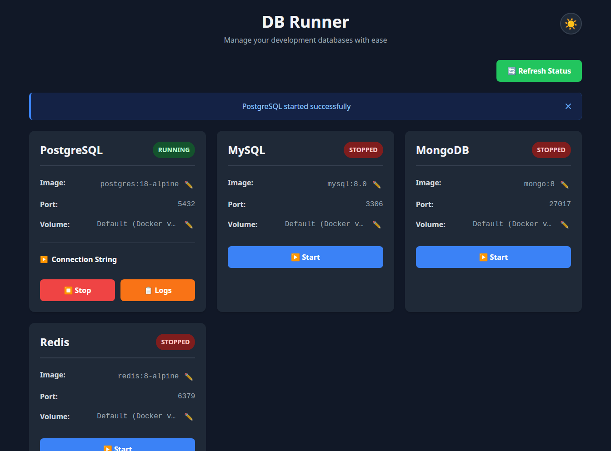

# DB Runner

A lightweight desktop application for managing development databases using Docker Compose.



## Features

- Start and stop popular databases with a single click
- Support for PostgreSQL, MySQL, MongoDB, and Redis
- Real-time status monitoring
- Pre-configured Docker Compose templates
- Custom volume paths for persistent data storage
- Configurable Docker image versions
- Dark/Light theme toggle
- Cross-platform desktop app built with Tauri

## Prerequisites

- Docker and Docker Compose installed
- pnpm package manager
- Rust toolchain (for development)

## Installation

```bash
# Install dependencies
pnpm install

# Run in development mode
pnpm tauri dev

# Build for production
pnpm tauri build
```

## Supported Databases

### PostgreSQL
- **Default Version**: postgres:18-alpine
- **Port**: 5432
- **Default credentials**:
  - User: `postgres`
  - Password: `postgres`
  - Database: `devdb`

### MySQL
- **Default Version**: mysql:8.0
- **Port**: 3306
- **Default credentials**:
  - Root password: `root`
  - User: `mysql`
  - Password: `mysql`
  - Database: `devdb`

### MongoDB
- **Default Version**: mongo:8
- **Port**: 27017
- **Default credentials**:
  - Username: `admin`
  - Password: `admin`
  - Database: `devdb`

### Redis
- **Default Version**: redis:8-alpine
- **Port**: 6379
- **Authentication**: None (suitable for local development only)

**Note**: All database versions can be customized through the UI by clicking the edit icon (✏️) next to the image tag.

## Usage

### Basic Operations
1. Launch the application
2. Click "Start" on any database card to start that database
3. Click "Stop" to stop a running database
4. Use the "Refresh Status" button to update the status of all databases

### Custom Volume Paths
By default, databases use Docker named volumes. To use a custom directory for persistent storage:

1. Click the edit icon (✏️) next to "Volume" on any database card
2. Either:
   - Click the folder icon (📁) to browse and select a directory
   - Manually enter the full path to your desired directory
3. Click "Save" to apply the custom path
4. The next time you start the database, it will use your custom directory

**Note**: The directory must already exist before you can set it as a volume path.

## Architecture

- **Frontend**: SvelteKit + TypeScript
- **Backend**: Rust + Tauri
- **Container Management**: Docker Compose

## Project Structure

```
dbrunner/
├── src/                    # SvelteKit frontend
│   └── routes/
│       └── +page.svelte   # Main UI
├── src-tauri/              # Rust backend
│   ├── src/
│   │   └── lib.rs         # Tauri commands
│   └── Cargo.toml
├── docker-templates/       # Docker Compose templates
│   ├── postgres.yml
│   ├── mysql.yml
│   └── mongodb.yml
└── package.json
```

## Future Enhancements

- [x] Customizable database versions
- [x] Custom volume paths
- [ ] Environment variable configuration
- [x] Database connection string generator
- [ ] Multiple instances of the same database
- [ ] Import/export configurations
- [x] Container logs viewer

## Disclaimer

This project is mostly vibe-coded and built as a tool for my personal development workflow. No guarantees are made regarding code quality, comprehensive testing, or fitness for your specific use case. Use at your own risk, and feel free to fork and adapt to your needs!

## License

MIT
